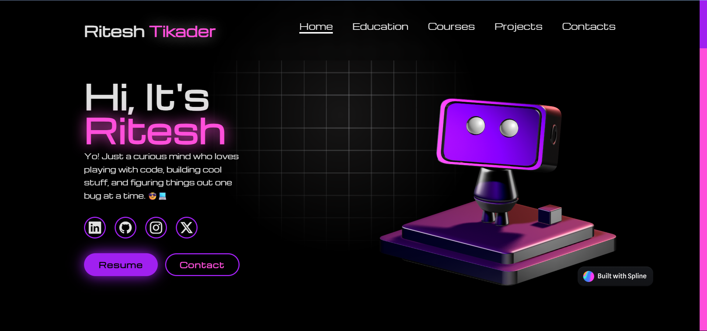

# 💼 Ritesh Tikader - Portfolio Website

A futuristic, responsive, and interactive personal portfolio website built using **HTML**, **CSS**, and **JavaScript**. It includes animated visuals, course certifications, project showcases, and a contact form with Formspree integration.



## 🚀 Live Demo

> [Click here to view the live portfolio](https://myproject-nine-smoky.vercel.app/)

---

## 📌 Sections

* **Home** – Intro, social links, and resume button
* **Education** – Academic timeline with stylish animation
* **Courses** – Certifications with direct certificate links
* **Projects** – Highlighted projects with tech stack badges and GitHub links
* **Contact** – Contact form integrated with Formspree

---

## 🛠️ Technologies Used

* **HTML5** – Semantic layout and content structuring
* **CSS3** – Responsive grid, animations, and custom scrollbars
* **JavaScript** – Scroll-based navigation highlight, spotlight animation
* **Spline 3D Model** – Embedded animated 3D scene
* **Bootstrap Icons** – For social and UI icons
* **Formspree** – To handle contact form submissions

---

## 🎮 Key Features

* ✨ **Spotlight Effect**: Follows mouse movement for dramatic lighting
* 🧠 **Scroll Spy Navigation**: Highlights current section in navbar
* 📜 **Timeline View**: For education and course details
* 📄 **Downloadable Resume**: Easily accessible via CTA button
* 📬 **Working Contact Form**: Using Formspree backend

---

## 📂 How to Run Locally

```bash
# Clone the repo
git clone https://github.com/Ritesh-45/Portfolio.git

# Open in your browser
Open index.html in your preferred browser
```
